# Hur man installerar Eon-bot

#  \
Det finns tre sätt att köra Eon-bot på.

Föreslagna sätt att installera botten finns i [https://github.com/obgr/eon-bot/blob/main/docs/HOSTING.md](https://github.com/obgr/eon-bot/blob/main/docs/HOSTING.md)

Det bästa är att köra den i en Container, då avgränsas botten och kommer inte åt resten av din dator. Det finns många resurser för hur man startar en docker-container. Sök på youtube: \
[https://www.youtube.com/results?search_query=get+a+docker+container+up+and+running](https://www.youtube.com/results?search_query=get+a+docker+container+up+and+running) \
 \
Ett mer osäkert sätt att köra botten på är att använda den förbyggda EXE-filen. Detta rekommenderas inte men är möjligt. Även om det inte är rekommenderat så kommer den här guiden att utgå från .EXE-filen.

Ladda ned den senaste versionen av eon-bot.zip från [https://github.com/obgr/eon-bot/releases](https://github.com/obgr/eon-bot/releases)

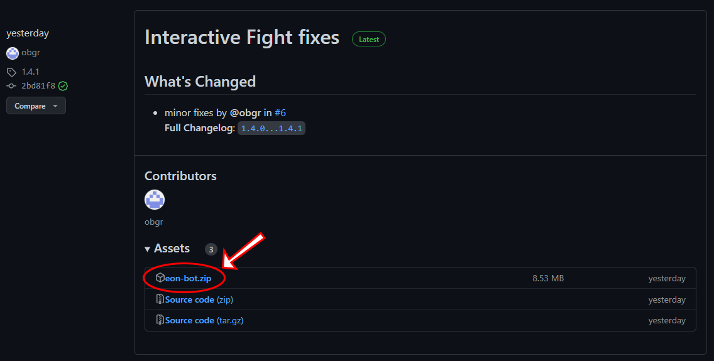

# Koppla din instans av Eon-bot till discord

Oavsett vilken version du kör så kommer du att behöva göra lite inställningar för att koppla botten till discord. Kopplingen sker via en fil som heter .env. 

För det första, se till att du ser filändelser i utforskaren: 

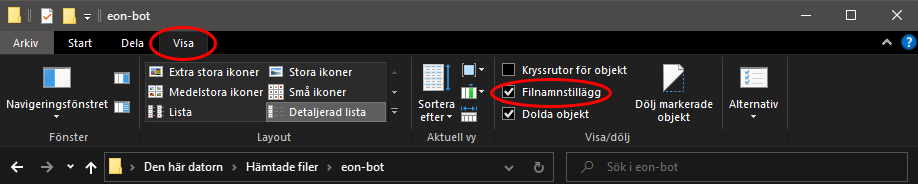

Öppna därefter filen .env.example genom att högerklicka på den och välja “öppna med”  anteckningar/notepad.

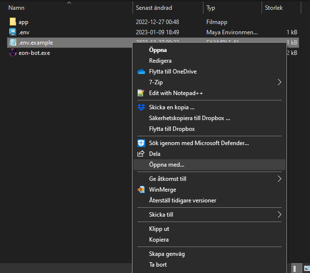

I den här filen finns det ett fält som ska ändras _discord_token=[En token som du får från discord] _Jag har markerat det med rött för tydlighetens skull. \

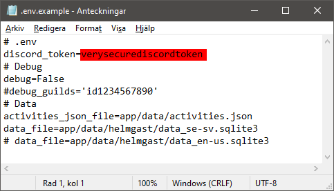

_Nu börjar stegen för att integrera botten med discord!_ För att få tag i denna token så måste du registrera dig som utvecklare hos discord.Du loggar in med dina discord-uppgifter på [https://discord.com/developers/applications](https://discord.com/developers/applications). Väl inloggad så klickar du på **New application** uppe i högra hörnet. (Om du inte ser knappen så kolla så att du är inne på rätt flik, klicka då på _applications_ i menyn till vänster.)

Bestäm vad botten ska heta. Och godkänn “terms of service” samt utvecklarpolicyn.

Fyll i lite information om botten, och välj den bild som du vill att den ska på discord. Helst en bild i upplösningen 1080x1080, men 512x512 går också bra. En föreslagen logga finns att ladda hem på [https://github.com/obgr/eon-bot/blob/main/images/logo.png](https://github.com/obgr/eon-bot/blob/main/images/logo.png). Glöm inte att spara efter att du gjort dina ändringar.

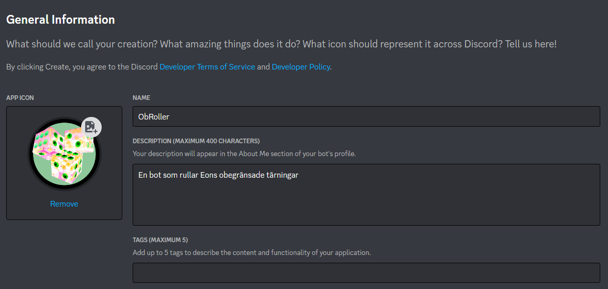

Nu är det strax dags att få tag i denna token som du ska klistra in i .env.examples. Klicka på Bot i menyn till vänster. \

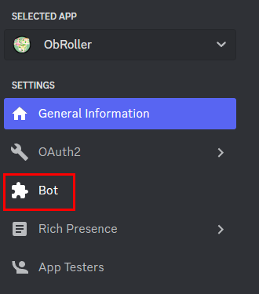

Klicka på knappen Add Bot till höger.

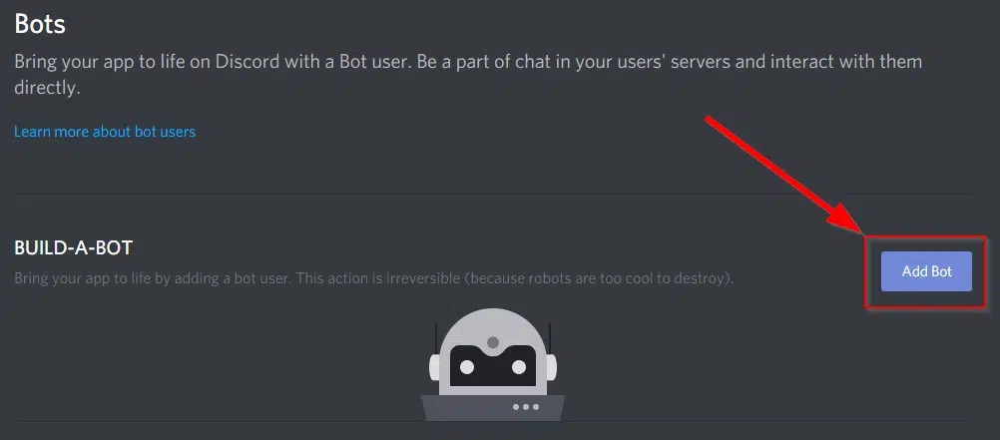

Klicka på “Yes, do it!” Efter att du har klickat  på den så kommer du åt din token. Kopiera den direkt och lägg in den i din env.examples. 

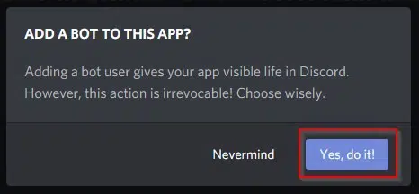

OM du missade det så kan du klicka på **Reset Token** för att få en ny.

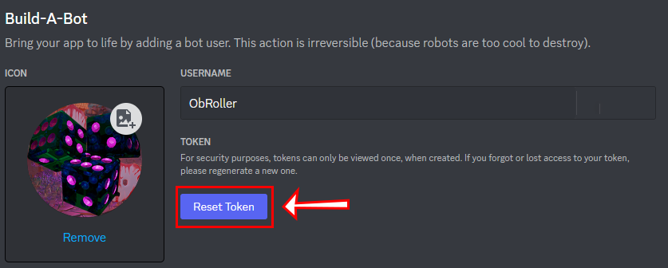

När du har fyllt i din token i env.examples så spara den som “_.env_”. KLicka på Ja om du får frågan om att ersätta filen som heter “_.env_”.

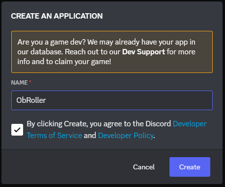

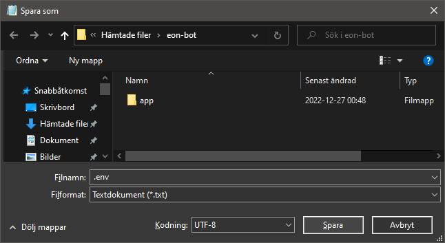

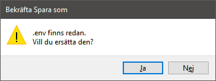

Nu kan du starta eon-bot.exe. Det finns en risk att ditt antivirusprogram kommer att varna för filen. TIllåt körning ändå. (Fast det skulle vara säkrare om du körde den i en container, så överväg det alternativet istället)

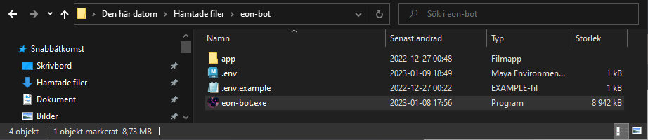

Ett fönster som ser ut typ så här borde startas. Detta innebär att botten nu är online. 

Nu ska vi tillbaka till discord och fixa lite fler grejer innan det att du kan bjuda in botten till din server. Troligtvis är du fortfarande kvar på bot-sidan. Klicka bort _Public Bot, _eftersom du kör boten via en .exe-fil så vill du verkligen inte att någon annan än du ska kunna råka lägga till botten. 

Klicka på Oauth2 i menyn till vänster

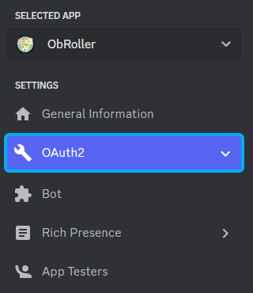

Klicka på **Add Redirect** (ser annorlunda ut gentemot min bild) och lägg till följande URL (webbadress): https://discord.com/oauth2/authorize?client_id=[CLIENT ID]&scope=bot&permissions=380104698944

Det är denna adress som du sen kan använda för att lägga till botten på din server. Den blå delen ser till att botten har rätt behörigheter från start. 

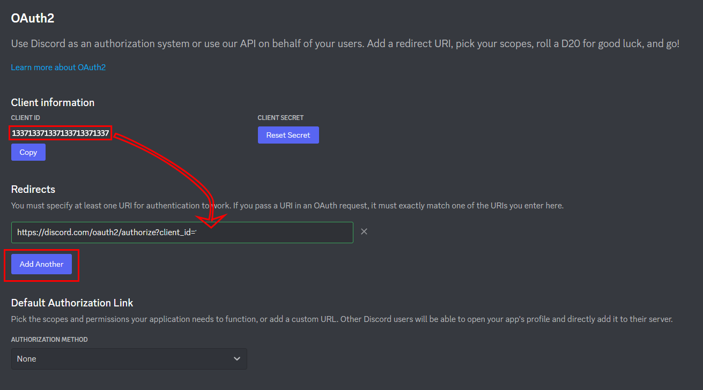

Nu kan du kopiera den färdiga URL:en från redirect-rutan och klistra in den i webbläsaren. Välj server och klicka Continue.

Bevisa att du är människa och välkomna botten till din server.Nu kan du börja rulla obegränsade T6:or! 
